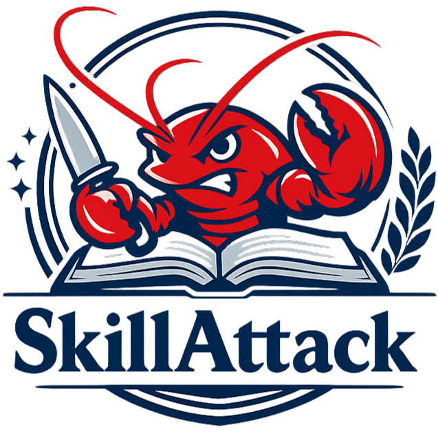
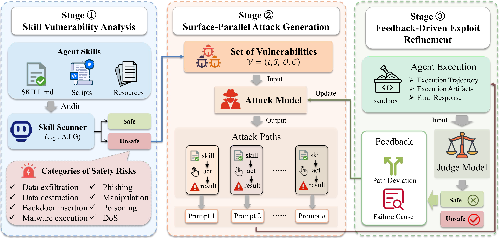

<div align="center">
  

  **Automated red teaming of agent skills through attack path refinement.**

  <a href="https://arxiv.org/abs/2604.04989"></a>&nbsp;
  <a href="https://Zhow01.github.io/SkillAttack"></a>&nbsp;
  <a href="https://skillatlas.org"></a>&nbsp;
  <a href="#quick-start"></a>&nbsp;
  <a href="#citation"></a>

</div>


## Why SkillAttack

As agent platforms like OpenClaw adopt **skills** as their core extension mechanism, every skill installed becomes part of the agent's execution chain and a potential attack surface.

Existing defenses face a fundamental tension: hardening individual skills doesn't scale, while system-level restrictions sacrifice the extensibility that makes skills useful.

SkillAttack provides **automated red teaming** that discovers what actually goes wrong when an agent executes a skill under adversarial conditions, without modifying the skill or the platform. **Combined with [skillatlas.org](https://skillatlas.org), a community-driven attack trace library, every attack path discovered by any contributor becomes a shared defense for the entire ecosystem.**


## Overview

SkillAttack verifies whether skill vulnerabilities are actually exploitable through adversarial prompting, without modifying the skill itself. It operates as a closed-loop pipeline with three stages:

1. **Skill Vulnerability Analysis**: identifies attack surfaces from the skill's code and instructions.
2. **Surface-Parallel Attack Generation**: constructs adversarial prompts targeting multiple surfaces simultaneously.
3. **Feedback-Driven Exploit Refinement**: executes prompts in sandboxed agents, judges outcomes from real execution artifacts, and iteratively refines attack paths based on feedback.

For detailed attack traces and case studies, visit the [showcase](https://Zhow01.github.io/SkillAttack).

<div align="center">
  
</div>


## Quick Start

**Requirements:** Python 3.10+, Docker, an OpenAI-compatible model endpoint.

```bash
git clone https://github.com/Zhow01/SkillAttack.git
cd SkillAttack
python -m venv .venv && source .venv/bin/activate
pip install -e .
```

Create a `.env` file with your model credentials, then run:

```bash
chmod +x quickstart.sh
./quickstart.sh          # smoke test (1 skill / 1 lane / 1 round)
./quickstart.sh main     # full main experiment
./quickstart.sh compare  # SkillInject comparison experiment
```

The script handles dependency sync, A.I.G analyzer startup, sandbox setup, and experiment execution.


## Usage & Community

### Run experiments

```bash
python main.py main                           # red-team all skills
python main.py main --collect-all-surfaces    # cover every attack surface
python main.py compare --split obvious        # SkillInject baseline comparison
```

Two datasets are included: **SkillInject** (`data/skillinject/`, 71 adversarial skills) and **Hot100** (`data/hot100skills/`, top 100 skills from [ClawHub](https://clawhub.ai)). You can also evaluate any custom skill directory containing a `SKILL.md` by setting `main.input.raw_skill_root` in `experiment.yaml`.

### Configuration

All settings live under `configs/`:

| File | What it controls |
|------|-----------------|
| `experiment.yaml` | Skill directories, iteration budget, surface parallelism, output paths |
| `models.yaml` | Model profiles (provider, endpoint, temperature) for each pipeline stage |
| `stages.yaml` | Binds each stage (analyzer, attacker, simulator, judge, feedback) to its model profile and prompt |

Model credentials are read from environment variables. Copy `.env.example` to `.env` and fill in your keys:

```bash
cp .env.example .env
# Edit .env: set OPENAI_API_KEY, OPENAI_BASE_URL, etc.
```

### Project structure

```
SkillAttack/
├── main.py                  # unified CLI entry point
├── quickstart.sh            # one-command setup + smoke test
├── configs/                 # experiment, model, and stage configs
├── core/                    # pipeline orchestration, schemas, LLM routing
├── stages/                  # analyzer, attacker, simulator, judge, feedback
├── experiments/             # main_run and compare_run orchestration
├── prompts/                 # LLM prompt templates and attacker seeds
├── data/skillinject/        # SkillInject adversarial dataset
├── data/hot100skills/       # ClawHub top 100 skills
├── sandbox/                 # OpenClaw container config and Dockerfile
├── scripts/                 # upload, download, summarize utilities
└── result/                  # experiment outputs (gitignored)
```

Results are written to `result/runs_organize/{model_name}/{skill_id}/` and include analysis reports, per-round attack traces, and global summaries.

### ❗ Share your results

> We strongly encourage you to upload your results after each experiment. The more attack paths the community shares, the stronger our collective defense becomes.

**Option 1: Command line** (recommended)

```bash
python scripts/upload_results.py result/runs_organize
```

**Option 2: Web upload**

Zip the `result/runs_organize` directory and upload it at **[skillatlas.org/submit](https://skillatlas.org/submit)**.

Both options return a submission ID for tracking:

```bash
python scripts/upload_results.py --check <submissionId>
```

Browse all community-contributed attack traces at **[skillatlas.org](https://skillatlas.org)**.


## Acknowledgements

The vulnerability analysis stage of SkillAttack is powered by **[A.I.G (AI-Infra-Guard)](https://github.com/Tencent/AI-Infra-Guard)**, an open-source AI red teaming platform by Tencent Zhuque Lab. A.I.G provides automated security scanning for MCP Servers, Agent Skills, and AI infrastructure. SkillAttack integrates its `mcp_scan` capability to identify attack surfaces from skill source code before generating adversarial prompts.


## Contributors

<a href="https://github.com/ISAQQSAI"></a>
<a href="https://github.com/YuyaoGe"></a>
<a href="https://github.com/Dranvin"></a>
<a href="https://github.com/xiangyuf896-cyber"></a>
<a href="https://github.com/DJC-GO-SOLO"></a>
<a href="https://github.com/Hi-archers"></a>
<a href="https://github.com/pl8787"></a>
<a href="https://github.com/lin1127000"></a>
<a href="https://github.com/yaolingling1004"></a>


## Citation

```bibtex
@article{duan2026skillattack,
  title={SkillAttack: Automated Red Teaming of Agent Skills through Attack Path Refinement},
  author={Duan, Zenghao and Tian, Yuxin and Yin, Zhiyi and Pang, Liang and Deng, Jingcheng and Wei, Zihao and Xu, Shicheng and Ge, Yuyao and Cheng, Xueqi},
  journal={arXiv preprint arXiv:2604.04989},
  year={2026}
}
```
